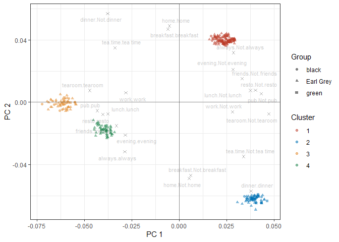
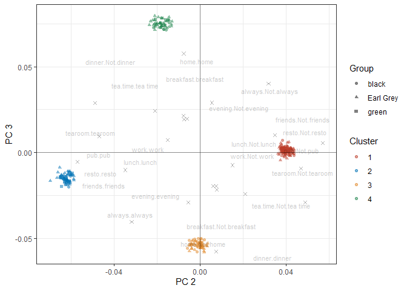
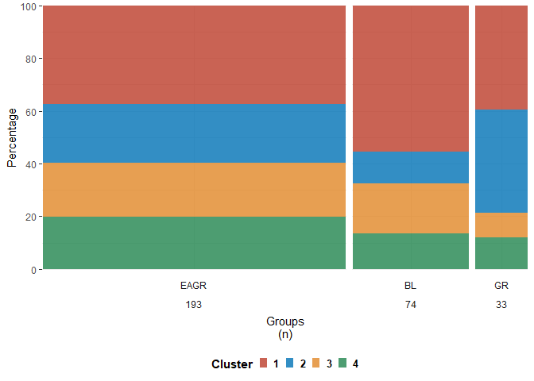
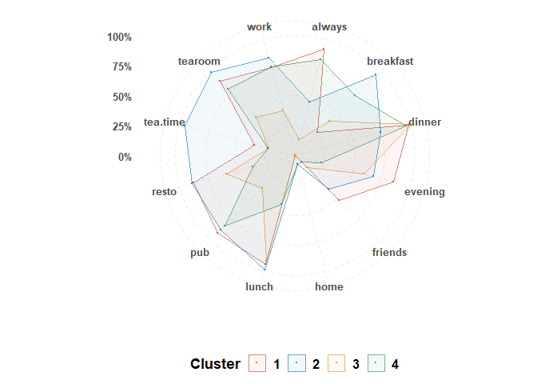
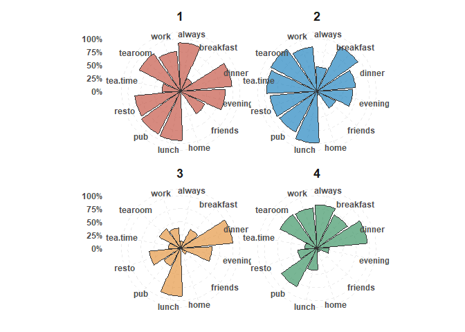
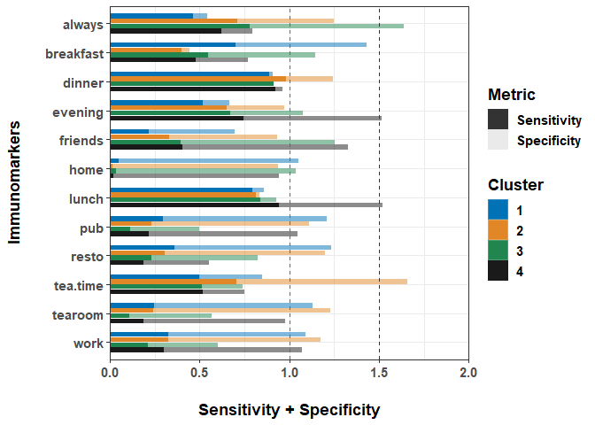
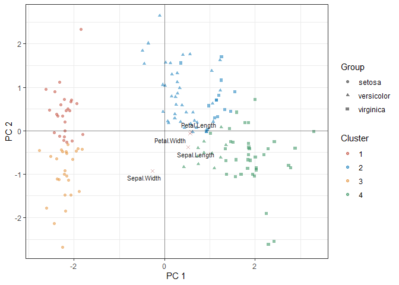
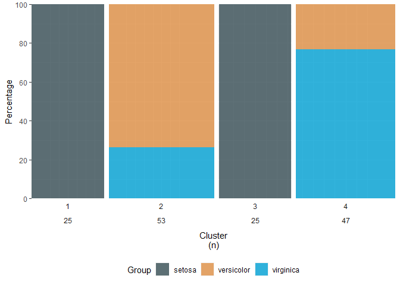
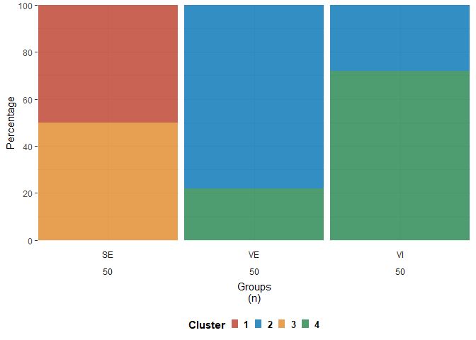

emr-cluster package
================

<!-- README.md is generated from README.Rmd. Please edit that file -->

## Development version

``` r
# install.packages("remotes")
#remotes::install_github("DHLab-TSENG/emr_clust")
```

## Useage

The goal of TEST is to unsupervised machine learning analysis process
integration (including feature selection, dimension reduction, group
analysis, visualization of group results, etc.)

This is a basic example which shows you how to solve a common problem:

``` r

library(TEST)
library(FactoMineR)
library(tidyverse)
library(reshape2)
library(data.table)
library(knitr)
## basic example code

#for categorical dataset with combine dimention reduction & clustering method example
data(tea)
# I. Data doing feature selection + dimention reduction + clustering with result presentation for distribution of variables
emr_cat<-emr_clust(tea[,1:13],
                   method =c("MCAk"),
                   kmoCutoff = 0.5,
                   nclus=c(4:5),
                   ndim=c(2:3),
                   group="Tea",
                   nstart=50)
#> 
#> bartlett_results isn't significant 
#> [1] "Running for 4 clusters and 2 dimensions..."
#>   |                                                                              |                                                                      |   0%  |                                                                              |=======                                                               |  10%  |                                                                              |==============                                                        |  20%  |                                                                              |=====================                                                 |  30%  |                                                                              |============================                                          |  40%  |                                                                              |===================================                                   |  50%  |                                                                              |==========================================                            |  60%  |                                                                              |=================================================                     |  70%  |                                                                              |========================================================              |  80%  |                                                                              |===============================================================       |  90%  |                                                                              |======================================================================| 100%[1] "Running for 4 clusters and 3 dimensions..."
#>   |                                                                              |                                                                      |   0%  |                                                                              |=======                                                               |  10%  |                                                                              |==============                                                        |  20%  |                                                                              |=====================                                                 |  30%  |                                                                              |============================                                          |  40%  |                                                                              |===================================                                   |  50%  |                                                                              |==========================================                            |  60%  |                                                                              |=================================================                     |  70%  |                                                                              |========================================================              |  80%  |                                                                              |===============================================================       |  90%  |                                                                              |======================================================================| 100%[1] "Running for 5 clusters and 2 dimensions..."
#>   |                                                                              |                                                                      |   0%  |                                                                              |=======                                                               |  10%  |                                                                              |==============                                                        |  20%  |                                                                              |=====================                                                 |  30%  |                                                                              |============================                                          |  40%  |                                                                              |===================================                                   |  50%  |                                                                              |==========================================                            |  60%  |                                                                              |=================================================                     |  70%  |                                                                              |========================================================              |  80%  |                                                                              |===============================================================       |  90%  |                                                                              |======================================================================| 100%[1] "Running for 5 clusters and 3 dimensions..."
#>   |                                                                              |                                                                      |   0%  |                                                                              |=======                                                               |  10%  |                                                                              |==============                                                        |  20%  |                                                                              |=====================                                                 |  30%  |                                                                              |============================                                          |  40%  |                                                                              |===================================                                   |  50%  |                                                                              |==========================================                            |  60%  |                                                                              |=================================================                     |  70%  |                                                                              |========================================================              |  80%  |                                                                              |===============================================================       |  90%  |                                                                              |======================================================================| 100%  |                                                                              |                                                                      |   0%  |                                                                              |=======                                                               |  10%  |                                                                              |==============                                                        |  20%  |                                                                              |=====================                                                 |  30%  |                                                                              |============================                                          |  40%  |                                                                              |===================================                                   |  50%  |                                                                              |==========================================                            |  60%  |                                                                              |=================================================                     |  70%  |                                                                              |========================================================              |  80%  |                                                                              |===============================================================       |  90%  |                                                                              |======================================================================| 100%
#show the tuning output table
kable(head(emr_cat$clust_out$tune_table),"html")
```

<table>
<thead>
<tr>
<th style="text-align:left;">
</th>
<th style="text-align:left;">
Dim2
</th>
<th style="text-align:left;">
Dim3
</th>
</tr>
</thead>
<tbody>
<tr>
<td style="text-align:left;">
4
</td>
<td style="text-align:left;">
0.166
</td>
<td style="text-align:left;">
0.198
</td>
</tr>
<tr>
<td style="text-align:left;">
5
</td>
<td style="text-align:left;">
0.127
</td>
<td style="text-align:left;">
0.171
</td>
</tr>
</tbody>
</table>

``` r
#show the statistic table
kable(head(emr_cat$statistics_table$PC_data),"html")
```

<table>
<thead>
<tr>
<th style="text-align:right;">
PC 1
</th>
<th style="text-align:right;">
PC 2
</th>
<th style="text-align:right;">
PC 3
</th>
<th style="text-align:left;">
Cluster
</th>
<th style="text-align:left;">
breakfast
</th>
<th style="text-align:left;">
tea.time
</th>
<th style="text-align:left;">
evening
</th>
<th style="text-align:left;">
lunch
</th>
<th style="text-align:left;">
dinner
</th>
<th style="text-align:left;">
always
</th>
<th style="text-align:left;">
home
</th>
<th style="text-align:left;">
work
</th>
<th style="text-align:left;">
tearoom
</th>
<th style="text-align:left;">
friends
</th>
<th style="text-align:left;">
resto
</th>
<th style="text-align:left;">
pub
</th>
<th style="text-align:left;">
Tea
</th>
<th style="text-align:left;">
Group
</th>
</tr>
</thead>
<tbody>
<tr>
<td style="text-align:right;">
0.0285252
</td>
<td style="text-align:right;">
0.0402456
</td>
<td style="text-align:right;">
0.0004505
</td>
<td style="text-align:left;">
1
</td>
<td style="text-align:left;">
breakfast
</td>
<td style="text-align:left;">
Not.tea time
</td>
<td style="text-align:left;">
Not.evening
</td>
<td style="text-align:left;">
Not.lunch
</td>
<td style="text-align:left;">
Not.dinner
</td>
<td style="text-align:left;">
Not.always
</td>
<td style="text-align:left;">
home
</td>
<td style="text-align:left;">
Not.work
</td>
<td style="text-align:left;">
Not.tearoom
</td>
<td style="text-align:left;">
Not.friends
</td>
<td style="text-align:left;">
Not.resto
</td>
<td style="text-align:left;">
Not.pub
</td>
<td style="text-align:left;">
black
</td>
<td style="text-align:left;">
black
</td>
</tr>
<tr>
<td style="text-align:right;">
0.0285252
</td>
<td style="text-align:right;">
0.0402456
</td>
<td style="text-align:right;">
0.0004505
</td>
<td style="text-align:left;">
1
</td>
<td style="text-align:left;">
breakfast
</td>
<td style="text-align:left;">
Not.tea time
</td>
<td style="text-align:left;">
Not.evening
</td>
<td style="text-align:left;">
Not.lunch
</td>
<td style="text-align:left;">
Not.dinner
</td>
<td style="text-align:left;">
Not.always
</td>
<td style="text-align:left;">
home
</td>
<td style="text-align:left;">
Not.work
</td>
<td style="text-align:left;">
Not.tearoom
</td>
<td style="text-align:left;">
Not.friends
</td>
<td style="text-align:left;">
Not.resto
</td>
<td style="text-align:left;">
Not.pub
</td>
<td style="text-align:left;">
black
</td>
<td style="text-align:left;">
black
</td>
</tr>
<tr>
<td style="text-align:right;">
-0.0374653
</td>
<td style="text-align:right;">
-0.0216717
</td>
<td style="text-align:right;">
0.0733575
</td>
<td style="text-align:left;">
4
</td>
<td style="text-align:left;">
Not.breakfast
</td>
<td style="text-align:left;">
tea time
</td>
<td style="text-align:left;">
evening
</td>
<td style="text-align:left;">
Not.lunch
</td>
<td style="text-align:left;">
dinner
</td>
<td style="text-align:left;">
Not.always
</td>
<td style="text-align:left;">
home
</td>
<td style="text-align:left;">
work
</td>
<td style="text-align:left;">
Not.tearoom
</td>
<td style="text-align:left;">
friends
</td>
<td style="text-align:left;">
resto
</td>
<td style="text-align:left;">
Not.pub
</td>
<td style="text-align:left;">
Earl Grey
</td>
<td style="text-align:left;">
Earl Grey
</td>
</tr>
<tr>
<td style="text-align:right;">
0.0457808
</td>
<td style="text-align:right;">
-0.0630318
</td>
<td style="text-align:right;">
-0.0145051
</td>
<td style="text-align:left;">
2
</td>
<td style="text-align:left;">
Not.breakfast
</td>
<td style="text-align:left;">
Not.tea time
</td>
<td style="text-align:left;">
Not.evening
</td>
<td style="text-align:left;">
Not.lunch
</td>
<td style="text-align:left;">
dinner
</td>
<td style="text-align:left;">
Not.always
</td>
<td style="text-align:left;">
home
</td>
<td style="text-align:left;">
Not.work
</td>
<td style="text-align:left;">
Not.tearoom
</td>
<td style="text-align:left;">
Not.friends
</td>
<td style="text-align:left;">
Not.resto
</td>
<td style="text-align:left;">
Not.pub
</td>
<td style="text-align:left;">
Earl Grey
</td>
<td style="text-align:left;">
Earl Grey
</td>
</tr>
<tr>
<td style="text-align:right;">
0.0244414
</td>
<td style="text-align:right;">
0.0363576
</td>
<td style="text-align:right;">
-0.0007369
</td>
<td style="text-align:left;">
1
</td>
<td style="text-align:left;">
breakfast
</td>
<td style="text-align:left;">
Not.tea time
</td>
<td style="text-align:left;">
evening
</td>
<td style="text-align:left;">
Not.lunch
</td>
<td style="text-align:left;">
Not.dinner
</td>
<td style="text-align:left;">
always
</td>
<td style="text-align:left;">
home
</td>
<td style="text-align:left;">
Not.work
</td>
<td style="text-align:left;">
Not.tearoom
</td>
<td style="text-align:left;">
Not.friends
</td>
<td style="text-align:left;">
Not.resto
</td>
<td style="text-align:left;">
Not.pub
</td>
<td style="text-align:left;">
Earl Grey
</td>
<td style="text-align:left;">
Earl Grey
</td>
</tr>
<tr>
<td style="text-align:right;">
0.0457808
</td>
<td style="text-align:right;">
-0.0630318
</td>
<td style="text-align:right;">
-0.0145051
</td>
<td style="text-align:left;">
2
</td>
<td style="text-align:left;">
Not.breakfast
</td>
<td style="text-align:left;">
Not.tea time
</td>
<td style="text-align:left;">
Not.evening
</td>
<td style="text-align:left;">
Not.lunch
</td>
<td style="text-align:left;">
dinner
</td>
<td style="text-align:left;">
Not.always
</td>
<td style="text-align:left;">
home
</td>
<td style="text-align:left;">
Not.work
</td>
<td style="text-align:left;">
Not.tearoom
</td>
<td style="text-align:left;">
Not.friends
</td>
<td style="text-align:left;">
Not.resto
</td>
<td style="text-align:left;">
Not.pub
</td>
<td style="text-align:left;">
Earl Grey
</td>
<td style="text-align:left;">
Earl Grey
</td>
</tr>
</tbody>
</table>

``` r
kable(head(emr_cat$statistics_table$attr_data),"html")
```

<table>
<thead>
<tr>
<th style="text-align:left;">
Variable
</th>
<th style="text-align:right;">
PC 1
</th>
<th style="text-align:right;">
PC 2
</th>
<th style="text-align:right;">
PC 3
</th>
</tr>
</thead>
<tbody>
<tr>
<td style="text-align:left;">
breakfast.breakfast
</td>
<td style="text-align:right;">
-0.0059411
</td>
<td style="text-align:right;">
0.0470162
</td>
<td style="text-align:right;">
-0.0093285
</td>
</tr>
<tr>
<td style="text-align:left;">
breakfast.Not.breakfast
</td>
<td style="text-align:right;">
0.0059411
</td>
<td style="text-align:right;">
-0.0470162
</td>
<td style="text-align:right;">
0.0093285
</td>
</tr>
<tr>
<td style="text-align:left;">
tea.time.Not.tea time
</td>
<td style="text-align:right;">
0.0339959
</td>
<td style="text-align:right;">
-0.0348613
</td>
<td style="text-align:right;">
-0.0101065
</td>
</tr>
<tr>
<td style="text-align:left;">
tea.time.tea time
</td>
<td style="text-align:right;">
-0.0339959
</td>
<td style="text-align:right;">
0.0348613
</td>
<td style="text-align:right;">
0.0101065
</td>
</tr>
<tr>
<td style="text-align:left;">
evening.evening
</td>
<td style="text-align:right;">
-0.0284692
</td>
<td style="text-align:right;">
-0.0209811
</td>
<td style="text-align:right;">
0.0241691
</td>
</tr>
<tr>
<td style="text-align:left;">
evening.Not.evening
</td>
<td style="text-align:right;">
0.0284692
</td>
<td style="text-align:right;">
0.0209811
</td>
<td style="text-align:right;">
-0.0241691
</td>
</tr>
</tbody>
</table>

``` r
kable(head(emr_cat$statistics_table$use_table),"html")
```

<table>
<thead>
<tr>
<th style="text-align:left;">
Ori_Variable
</th>
<th style="text-align:left;">
Variable
</th>
<th style="text-align:left;">
black (n = 74)
</th>
<th style="text-align:left;">
Earl Grey (n = 193)
</th>
<th style="text-align:left;">
green (n = 33)
</th>
<th style="text-align:left;">
p value
</th>
</tr>
</thead>
<tbody>
<tr>
<td style="text-align:left;">
always
</td>
<td style="text-align:left;">
Not.always
</td>
<td style="text-align:left;">
55 (74.32)
</td>
<td style="text-align:left;">
119 (61.66)
</td>
<td style="text-align:left;">
23 (69.70)
</td>
<td style="text-align:left;">
0.130
</td>
</tr>
<tr>
<td style="text-align:left;">
</td>
<td style="text-align:left;">
always
</td>
<td style="text-align:left;">
19 (25.68)
</td>
<td style="text-align:left;">
74 (38.34)
</td>
<td style="text-align:left;">
10 (30.30)
</td>
<td style="text-align:left;">
</td>
</tr>
<tr>
<td style="text-align:left;">
breakfast
</td>
<td style="text-align:left;">
Not.breakfast
</td>
<td style="text-align:left;">
34 (45.95)
</td>
<td style="text-align:left;">
100 (51.81)
</td>
<td style="text-align:left;">
22 (66.67)
</td>
<td style="text-align:left;">
0.140
</td>
</tr>
<tr>
<td style="text-align:left;">
</td>
<td style="text-align:left;">
breakfast
</td>
<td style="text-align:left;">
40 (54.05)
</td>
<td style="text-align:left;">
93 (48.19)
</td>
<td style="text-align:left;">
11 (33.33)
</td>
<td style="text-align:left;">
</td>
</tr>
<tr>
<td style="text-align:left;">
dinner
</td>
<td style="text-align:left;">
Not.dinner
</td>
<td style="text-align:left;">
71 (95.95)
</td>
<td style="text-align:left;">
179 (92.75)
</td>
<td style="text-align:left;">
29 (87.88)
</td>
<td style="text-align:left;">
0.311
</td>
</tr>
<tr>
<td style="text-align:left;">
</td>
<td style="text-align:left;">
dinner
</td>
<td style="text-align:left;">
3 (4.05)
</td>
<td style="text-align:left;">
14 (7.25)
</td>
<td style="text-align:left;">
4 (12.12)
</td>
<td style="text-align:left;">
</td>
</tr>
</tbody>
</table>

``` r
#Biplot of the first and second principal components
emr_cat$biplot$clustering_biplots
#> [[1]]
```



    #> 
    #> [[2]]



``` r
#Profile the number and proportion of case in each cluster
emr_cat$biplot$profile_by_cluster_integrated
```


``` r
#Profile the number and proportion of case in each group
emr_cat$biplot$profile_by_group_integrated
```



``` r
# II. Visualization
#  1. Wind_rose_plot
pic<-wind_rose_plot(clustering_output = emr_cat, plot_value = "Not" )
pic$overlapped
```



``` r
pic$seperated
```



``` r
#  2. Sensitivity + Specificity plot
sen_spe_out<-sen_spe(clustering_output = emr_cat)
sen_spe_out
```



``` r

#for numerical dataset with seperate dimention reduction & clustering method example
data(iris)

# I. Data feature selection + dimention reduction + clustering with result presentation for distribution of variables
emr_numeric<-emr_clust(iris,
                       method =c("PCA","Kmean"),
                       center = TRUE,
                       scale = TRUE,
                       kmoCutoff = 0.5,
                       nclus=c(4:5),
                       ndim=c(2:3),
                       group="Species",
                       attr.params=list( fill="blue", color="darkred"),
                       text.params=list(alpha = 0.9))
#> 
#> bartlett_results isn't significant

#show the tuning output table
kable(head(emr_numeric$clust_out$tune_table),"html")
```

<table>
<thead>
<tr>
<th style="text-align:left;">
</th>
<th style="text-align:right;">
Dim2
</th>
<th style="text-align:right;">
Dim3
</th>
</tr>
</thead>
<tbody>
<tr>
<td style="text-align:left;">
4
</td>
<td style="text-align:right;">
0.4408934
</td>
<td style="text-align:right;">
0.4255930
</td>
</tr>
<tr>
<td style="text-align:left;">
5
</td>
<td style="text-align:right;">
0.4143378
</td>
<td style="text-align:right;">
0.3529726
</td>
</tr>
</tbody>
</table>

``` r
#show the statistic table
kable(head(emr_numeric$statistics_table$PC_data),"html")
```

<table>
<thead>
<tr>
<th style="text-align:right;">
PC 1
</th>
<th style="text-align:right;">
PC 2
</th>
<th style="text-align:left;">
Cluster
</th>
<th style="text-align:right;">
Sepal.Length
</th>
<th style="text-align:right;">
Sepal.Width
</th>
<th style="text-align:right;">
Petal.Length
</th>
<th style="text-align:right;">
Petal.Width
</th>
<th style="text-align:left;">
Species
</th>
<th style="text-align:left;">
Group
</th>
</tr>
</thead>
<tbody>
<tr>
<td style="text-align:right;">
-2.257141
</td>
<td style="text-align:right;">
-0.4784238
</td>
<td style="text-align:left;">
3
</td>
<td style="text-align:right;">
5.1
</td>
<td style="text-align:right;">
3.5
</td>
<td style="text-align:right;">
1.4
</td>
<td style="text-align:right;">
0.2
</td>
<td style="text-align:left;">
setosa
</td>
<td style="text-align:left;">
setosa
</td>
</tr>
<tr>
<td style="text-align:right;">
-2.074013
</td>
<td style="text-align:right;">
0.6718827
</td>
<td style="text-align:left;">
1
</td>
<td style="text-align:right;">
4.9
</td>
<td style="text-align:right;">
3.0
</td>
<td style="text-align:right;">
1.4
</td>
<td style="text-align:right;">
0.2
</td>
<td style="text-align:left;">
setosa
</td>
<td style="text-align:left;">
setosa
</td>
</tr>
<tr>
<td style="text-align:right;">
-2.356335
</td>
<td style="text-align:right;">
0.3407664
</td>
<td style="text-align:left;">
1
</td>
<td style="text-align:right;">
4.7
</td>
<td style="text-align:right;">
3.2
</td>
<td style="text-align:right;">
1.3
</td>
<td style="text-align:right;">
0.2
</td>
<td style="text-align:left;">
setosa
</td>
<td style="text-align:left;">
setosa
</td>
</tr>
<tr>
<td style="text-align:right;">
-2.291707
</td>
<td style="text-align:right;">
0.5953999
</td>
<td style="text-align:left;">
1
</td>
<td style="text-align:right;">
4.6
</td>
<td style="text-align:right;">
3.1
</td>
<td style="text-align:right;">
1.5
</td>
<td style="text-align:right;">
0.2
</td>
<td style="text-align:left;">
setosa
</td>
<td style="text-align:left;">
setosa
</td>
</tr>
<tr>
<td style="text-align:right;">
-2.381863
</td>
<td style="text-align:right;">
-0.6446757
</td>
<td style="text-align:left;">
3
</td>
<td style="text-align:right;">
5.0
</td>
<td style="text-align:right;">
3.6
</td>
<td style="text-align:right;">
1.4
</td>
<td style="text-align:right;">
0.2
</td>
<td style="text-align:left;">
setosa
</td>
<td style="text-align:left;">
setosa
</td>
</tr>
<tr>
<td style="text-align:right;">
-2.068701
</td>
<td style="text-align:right;">
-1.4842053
</td>
<td style="text-align:left;">
3
</td>
<td style="text-align:right;">
5.4
</td>
<td style="text-align:right;">
3.9
</td>
<td style="text-align:right;">
1.7
</td>
<td style="text-align:right;">
0.4
</td>
<td style="text-align:left;">
setosa
</td>
<td style="text-align:left;">
setosa
</td>
</tr>
</tbody>
</table>

``` r
kable(head(emr_numeric$statistics_table$attr_data),"html")
```

<table>
<thead>
<tr>
<th style="text-align:left;">
Variable
</th>
<th style="text-align:right;">
PC 1
</th>
<th style="text-align:right;">
PC 2
</th>
<th style="text-align:right;">
PC 3
</th>
<th style="text-align:right;">
PC 4
</th>
</tr>
</thead>
<tbody>
<tr>
<td style="text-align:left;">
Sepal.Length
</td>
<td style="text-align:right;">
0.5210659
</td>
<td style="text-align:right;">
-0.3774176
</td>
<td style="text-align:right;">
0.7195664
</td>
<td style="text-align:right;">
0.2612863
</td>
</tr>
<tr>
<td style="text-align:left;">
Sepal.Width
</td>
<td style="text-align:right;">
-0.2693474
</td>
<td style="text-align:right;">
-0.9232957
</td>
<td style="text-align:right;">
-0.2443818
</td>
<td style="text-align:right;">
-0.1235096
</td>
</tr>
<tr>
<td style="text-align:left;">
Petal.Length
</td>
<td style="text-align:right;">
0.5804131
</td>
<td style="text-align:right;">
-0.0244916
</td>
<td style="text-align:right;">
-0.1421264
</td>
<td style="text-align:right;">
-0.8014492
</td>
</tr>
<tr>
<td style="text-align:left;">
Petal.Width
</td>
<td style="text-align:right;">
0.5648565
</td>
<td style="text-align:right;">
-0.0669420
</td>
<td style="text-align:right;">
-0.6342727
</td>
<td style="text-align:right;">
0.5235971
</td>
</tr>
</tbody>
</table>

``` r
kable(head(emr_numeric$statistics_table$use_table),"html")
```

<table>
<thead>
<tr>
<th style="text-align:left;">
Ori_Variable
</th>
<th style="text-align:left;">
Variable
</th>
<th style="text-align:left;">
setosa (n = 50)
</th>
<th style="text-align:left;">
versicolor (n = 50)
</th>
<th style="text-align:left;">
virginica (n = 50)
</th>
<th style="text-align:left;">
p value
</th>
</tr>
</thead>
<tbody>
<tr>
<td style="text-align:left;">
Petal.Length
</td>
<td style="text-align:left;">
</td>
<td style="text-align:left;">
1.5 ( 0.2)
</td>
<td style="text-align:left;">
4.3 ( 0.5)
</td>
<td style="text-align:left;">
5.6 ( 0.6)
</td>
<td style="text-align:left;">
\<0.001
</td>
</tr>
<tr>
<td style="text-align:left;">
Petal.Width
</td>
<td style="text-align:left;">
</td>
<td style="text-align:left;">
0.2 ( 0.1)
</td>
<td style="text-align:left;">
1.3 ( 0.2)
</td>
<td style="text-align:left;">
2.0 ( 0.3)
</td>
<td style="text-align:left;">
\<0.001
</td>
</tr>
<tr>
<td style="text-align:left;">
Sepal.Length
</td>
<td style="text-align:left;">
</td>
<td style="text-align:left;">
5.0 ( 0.4)
</td>
<td style="text-align:left;">
5.9 ( 0.5)
</td>
<td style="text-align:left;">
6.6 ( 0.6)
</td>
<td style="text-align:left;">
\<0.001
</td>
</tr>
<tr>
<td style="text-align:left;">
Sepal.Width
</td>
<td style="text-align:left;">
</td>
<td style="text-align:left;">
3.4 ( 0.4)
</td>
<td style="text-align:left;">
2.8 ( 0.3)
</td>
<td style="text-align:left;">
3.0 ( 0.3)
</td>
<td style="text-align:left;">
\<0.001
</td>
</tr>
</tbody>
</table>

``` r
#Biplot of the first and second principal components
emr_numeric$biplot$clustering_biplots
#> [[1]]
```



``` r
#Profile the number and proportion of case in each cluster
emr_numeric$biplot$profile_by_cluster_integrated
```



``` r
#Profile the number and proportion of case in each group
emr_numeric$biplot$profile_by_group_integrated
```



You’ll still need to render `README.Rmd` regularly, to keep `README.md`
up-to-date. `devtools::build_readme()` is handy for this. You could also
use GitHub Actions to re-render `README.Rmd` every time you push. An
example workflow can be found here:
<https://github.com/r-lib/actions/tree/v1/examples>.

In that case, don’t forget to commit and push the resulting figure
files, so they display on GitHub and CRAN.
